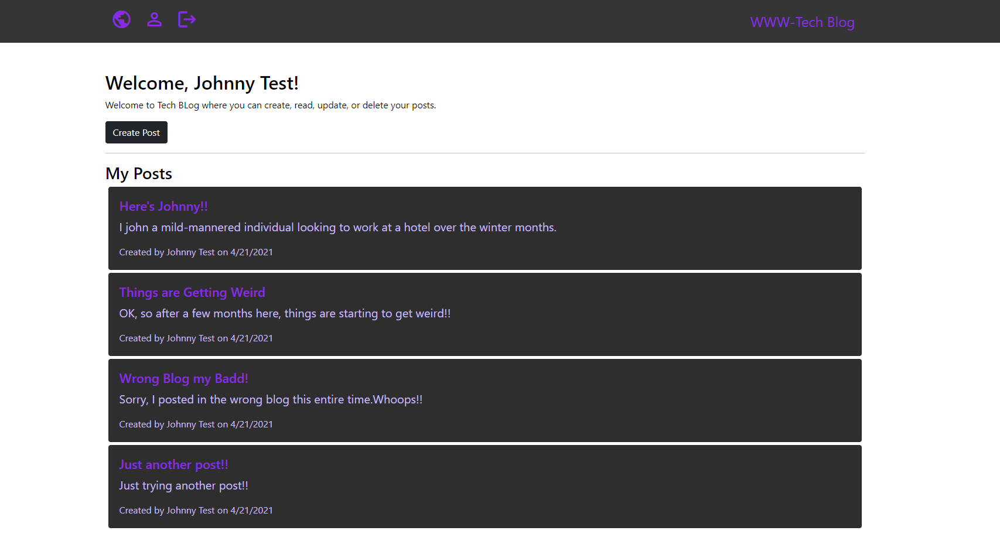

# Tech_Blog
Fullstack Homework

    

## Description

A tech Blog style page, with user login functionality, tracks users credentials data, as well as posts placed by all users. 
      
## Table of Contents
1. [Install Instructions](#install-instructions)
2. [Usage Instructions](#usage-instructions)
3. [License](#license)
4. [Contribution Guidelines](#contribution-guidelines)
5. [Test Instructions](#test-instructions)
6. [Questions](#questions)

## Install Instructions

Navigate to https://sleepy-basin-05391.herokuapp.com/

  
## Usage Instructions

View global posts on the home page. Login or signup to for accessand the ability to leave comments. Once logged in, navigate to the dashboard to view your posts, or create, update and delete posts.

## Images
</img>

## License
  
This application is licensed under MIT License.
     

    

## Contribution Guidelines

Contributions are welcome.

## Test Instructions

There are currently no tests.

## Questions

If you have any questions, contact the author:  

GitHub [@lpaschka](https://github.com/lpaschka37)  
Email [lpaschka37@gmail.com](mailto:lpaschka37@gmail.com)